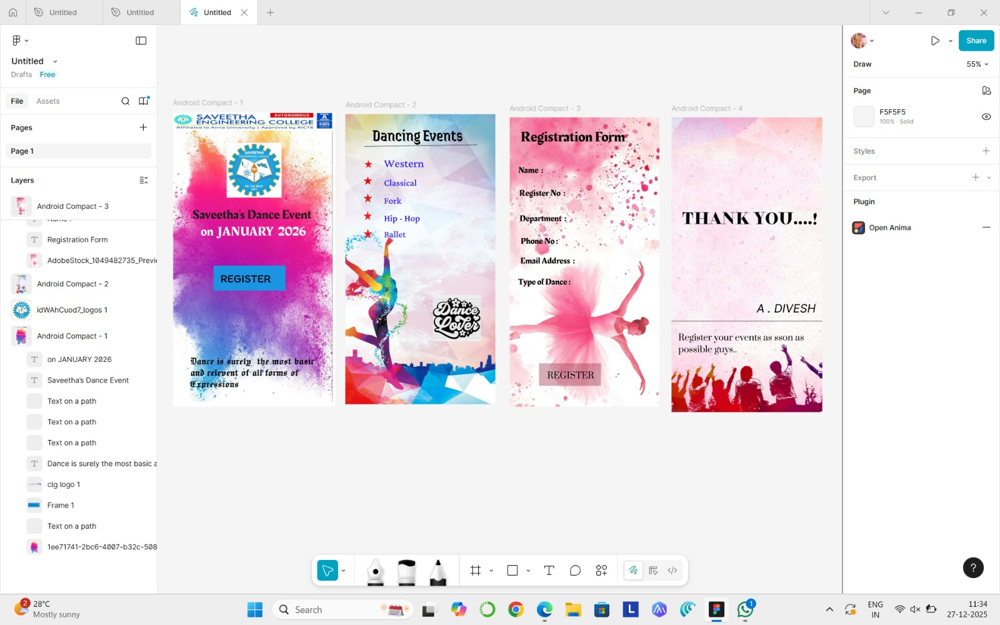

# Ex08 Event Registration Web Application
## Date:27-12-2025

## AIM:
To design, develop and deploy a web application for event registration using Figma UI tool.

## UI DESIGN TOOL:
Figma

## DESIGN STEPS:

### Step 1:
Use frames to represent screens or sections.

### Step 2:
Add column grids for consistent spacing and alignment.

### Step 3:
Insert shapes, text, buttons, and icons.

### Step 4:
Use Auto Layout for flexible, responsive design.

### Step 5:
Define color, text, and effect styles globally for consistency.

### Step 6:
Name layers logically and group related elements.

### Step 6:
Link frames to show navigation or interactions.

### Step 7:
Select the specific frame while generating code using Anima plugin.

## CODE:
```
page 1

<!DOCTYPE html>
<html>
  <head>
    <meta name="viewport" content="width=device-width, initial-scale=1" />
    <meta charset="utf-8" />
    <link rel="stylesheet" href="globals.css" />
    <link rel="stylesheet" href="style.css" />
  </head>
  <body>
    <div class="android-compact">
      
      
      <div class="frame">
        <div class="rectangle"></div>
        <div class="div"></div>
        <div class="text-wrapper">REGISTER</div>
      </div>
      
      <p class="dance-is-surely-the">
        Dance is surely&nbsp;&nbsp;the most basic and relevent of all forms of Expressions
      </p>
      
      
      
      <div class="text-wrapper-2">Saveetha’s Dance Event</div>
      <div class="on-JANUARY">on&nbsp;&nbsp;JANUARY&nbsp;&nbsp;2026</div>
    </div>
  </body>
</html>
```
```
page 2 

<!DOCTYPE html>
<html>
  <head>
    <meta name="viewport" content="width=device-width, initial-scale=1" />
    <meta charset="utf-8" />
    <link rel="stylesheet" href="globals.css" />
    <link rel="stylesheet" href="style.css" />
  </head>
  <body>
    <div class="android-compact">
      
      <div class="text-wrapper">Dancing Events</div>
      
      <div class="div">Western</div>
      
      
      
      <div class="text-wrapper-2">Classical</div>
      <div class="text-wrapper-3">Fork</div>
      <div class="text-wrapper-4">Hip - Hop</div>
      
      <div class="text-wrapper-5">Ballet</div>
      
      
    </div>
  </body>
</html>
```
```
page 3

<!DOCTYPE html>
<html>
  <head>
    <meta name="viewport" content="width=device-width, initial-scale=1" />
    <meta charset="utf-8" />
    <link rel="stylesheet" href="globals.css" />
    <link rel="stylesheet" href="style.css" />
  </head>
  <body>
    <div class="android-compact">
      
      <div class="text-wrapper">Registration Form</div>
      <input class="name" placeholder="Name&amp;nbsp;&amp;nbsp;:" type="text" />
      <div class="register-no">Register No&nbsp;&nbsp;:</div>
      <div class="department">Department&nbsp;&nbsp;:</div>
      <div class="div">Type of Dance :</div>
      <div class="text-wrapper-2">Phone No :</div>
      <div class="email-address">Email Address&nbsp;&nbsp;:</div>
      <div class="rectangle"></div>
      <div class="text-wrapper-3">REGISTER</div>
    </div>
  </body>
</html>
```
```
page 4

<!DOCTYPE html>
<html>
  <head>
    <meta name="viewport" content="width=device-width, initial-scale=1" />
    <meta charset="utf-8" />
    <link rel="stylesheet" href="globals.css" />
    <link rel="stylesheet" href="style.css" />
  </head>
  <body>
    <div class="android-compact">
      
      <div class="text-wrapper">THANK YOU....!</div>
      <p class="div">Register your events as sson as possible guys..</p>
      <div class="text-wrapper-2">A . DIVESH</div>
    </div>
  </body>
</html>
```


## OUTPUT:




## RESULT:
The program to design, develop and deploy a web application for event registration using Figma UI tool is completed successfully.
